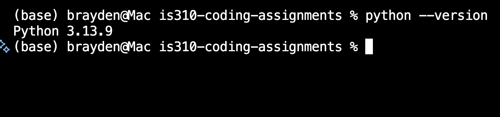
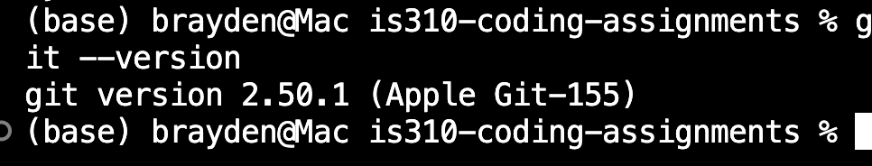
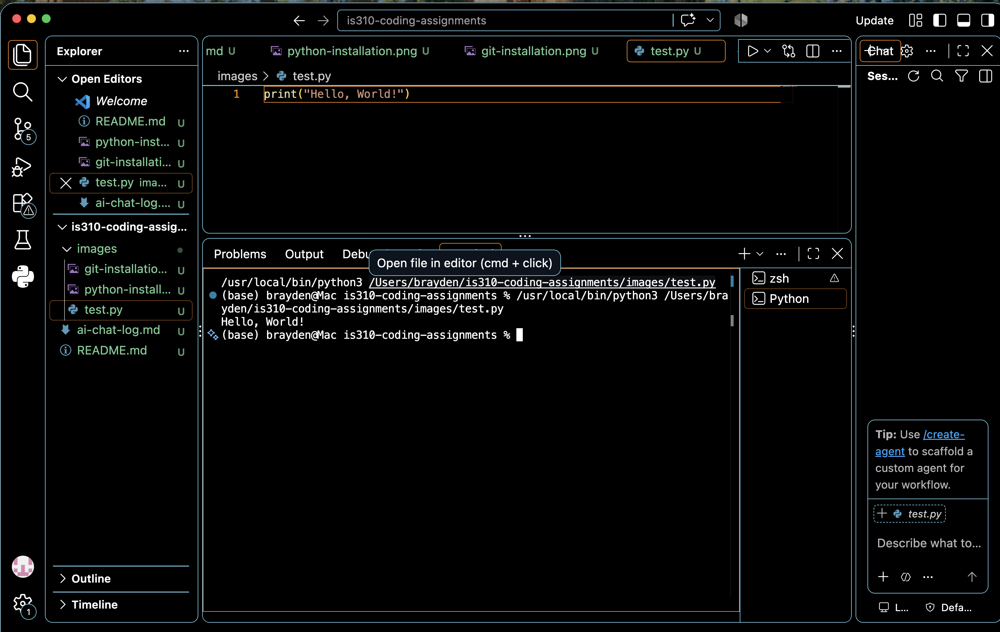

# Init IS310 Homework

## Proof of Installation

1. Python

2. Git

3. VS Code

4. Hypothesis Username : brayden.l

5. AI Tool/Workflow

I plan to use ChatGPT,Claude and possibly Copilot to help me understand course instructions, coding, Git, GitHub, and VS Code.

