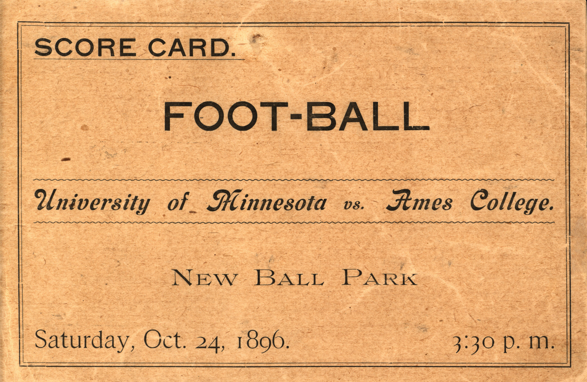

# AI Chat Log

**Student:** Brayden  
**Date:** October 1, 2026  
**AI assistant:** ChatGPT / Codex  
**Assignment:** Doing It Live, IS310

This log records the relevant prompts and responses used to add my introduction, GitHub link, and LinkedIn link to my previous Source & Style webpage. The football program webpage was supplied by me from my previous assignment. Earlier in the conversation, the assistant also helped explain the assignment requirements.

## Prompt 1: Review my existing webpage

I pasted my previous HTML webpage and wrote: “here is my code from the last assighment.” The page described the Iowa State vs. Minnesota football program from October 24, 1896. It included an image, description, metadata list, original object and collection links, and CSS styling.

### Assistant response

Your code already has the **digital object content, image, metadata, source links, list, and CSS styling**.

For the **personal website option**, add this directly below `<body>`, before your existing `<h1>`. Replace the placeholders with your information:

```html
<h2>Your Name</h2>
<p>Student at the University of Illinois Urbana-Champaign</p>
<p>I am interested in college football and learning how to
use digital collections to explore sports history.</p>
<p>
    <a href="https://github.com/YOURUSERNAME">My GitHub profile</a>
</p>
```

Then:

1. Save your webpage as **`index.html`**.
2. Include your image in the **`images` folder**, named `1896-football-program.jpg`.
3. Create **`ai-chat-log.md`** and paste the relevant questions and answers from this chat.
4. Publish the site using GitHub Pages.
5. Submit your **live website link** in the class discussion.

**If you choose the group option instead**, your page already includes the required content. Put it in your own folder in the group repository, and make sure the group has a homepage linking to your page.

## Prompt 2: Add LinkedIn to my introduction

I supplied this introduction:

```html
<h2>Brayden </h2>
<p>I am a Junior at the University of Illinois Urbana-Champaign studying information science</p>
<p>I am an Information Sciences student interested in pursuing a career in information security. Through my internship in Rush Hospital’s Information Technology department, I gained hands-on experience with security tools, including security information and event management (SIEM) systems, vulnerability management platforms, endpoint protection, and identity and access management tools. This experience strengthened my interest in protecting systems and data while building my technical and problem-solving skills.</p>
<p>
    <a href="https://github.com/YOURUSERNAME">My GitHub profile</a>
</p>
```

I asked: “add a small section for linked profile https://www.linkedin.com/feed/”.

### Assistant response

Add this below your GitHub link:

```html
<h2>Connect with me</h2>
<p>
    <a href="YOUR_LINKEDIN_PROFILE_URL">My LinkedIn profile</a>
</p>
```

The link you sent opens your LinkedIn **feed**. To get your profile link, open LinkedIn → **Me → View Profile**, then copy the address. Replace `YOUR_LINKEDIN_PROFILE_URL` with it.

## Prompt 3: Supply my LinkedIn profile URL

“www.linkedin.com/in/brayden-l-9725a3336”

### Assistant response

Add this below your GitHub link:

```html
<h2>Connect with me</h2>
<p>
    <a href="https://www.linkedin.com/in/brayden-l-9725a3336">
        My LinkedIn profile
    </a>
</p>
```

## Prompt 4: Combine the additions with my original code

“add these 2 parts to my website code i gave you before”

### Assistant response

Here’s your full code with your introduction and LinkedIn section added. Replace `YOURUSERNAME` with your GitHub username.

```html
<!DOCTYPE html>
<html lang="en">
<head>
    <meta charset="UTF-8">
    <meta name="viewport" content="width=device-width, initial-scale=1.0">
    <title>Brayden | 1896 Football Program</title>
    <style>
        body {
            background-color: lightyellow;
            font-family: Arial, sans-serif;
            margin: 30px;
        }
        h1 {
            color: darkred;
        }
        img {
            width: 600px;
            max-width: 100%;
        }
    </style>
</head>
<body>
    <h2>Brayden</h2>
    <p>I am a junior at the University of Illinois Urbana-Champaign studying Information Sciences.</p>
    <p>I am an Information Sciences student interested in pursuing a career in information security. Through my internship in Rush Hospital’s Information Technology department, I gained hands-on experience with security tools, including security information and event management (SIEM) systems, vulnerability management platforms, endpoint protection, and identity and access management tools. This experience strengthened my interest in protecting systems and data while building my technical and problem-solving skills.</p>
    <p>
        <a href="https://github.com/YOURUSERNAME">My GitHub profile</a>
    </p>

    <h2>Connect with me</h2>
    <p>
        <a href="https://www.linkedin.com/in/brayden-l-9725a3336">My LinkedIn profile</a>
    </p>

    <h1>Iowa State vs. Minnesota, October 24, 1896</h1>
    <div>
        
        <p>Image from Iowa State University Library Digital Collections.</p>

        <h2>About this program</h2>
        <p>This is a digitized football program for Iowa State's game against Minnesota on October 24, 1896. The program has twelve pages and includes player photographs and advertisements. The first page calls Iowa State Ames College.</p>
        <p>I picked this object because I am interested in college football. I thought it was cool to see what a football program looked like in 1896 and compare it to what fans see today.</p>

        <h2>Metadata</h2>
        <ul>
            <li>Date: October 24, 1896</li>
            <li>Creator: University of Minnesota, Department of Athletics</li>
            <li>Location: Minneapolis, Minnesota</li>
            <li>Length: 12 pages</li>
            <li>Type: Souvenir program</li>
            <li>Collection: Iowa State University Football Programs</li>
            <li>Identifier: isufootballprograms318</li>
        </ul>

        <h2>Sources</h2>
        <p><a href="https://digitalcollections.lib.iastate.edu/isufootballprograms/items/isufootballprograms318.html">View the original program</a></p>
        <p><a href="https://digitalcollections.lib.iastate.edu/isufootballprograms/">View the original collection</a></p>
        <p>The library marks this object as in copyright and provides access for education and scholarship. I am using this image for a class assignment.</p>
    </div>
</body>
</html>
```

## Prompt 5: Create this log

“create me that ai chat log now”

The assistant created this Markdown file from the conversation. The first prompt is summarized, and formatting artifacts in my introduction have been cleaned up for readability.
